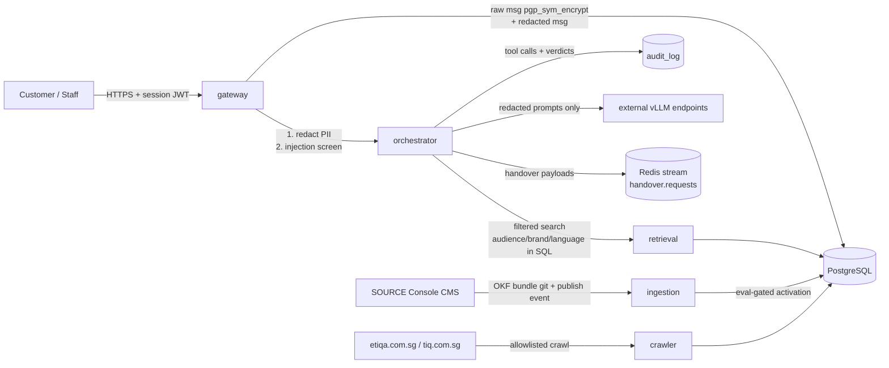

# Data-flow diagram (compliance evidence, §10.4)

Key properties for review:

1. **PII never reaches the model.** The gateway redacts NRIC/FIN, passport,
   policy numbers, emails and phone numbers before forwarding
   (`gateway/redaction.py`); only the redacted form is sent to the
   orchestrator and on to external LLM endpoints.
2. **Raw content is encrypted at rest** when `MESSAGE_ENC_KEY` is set
   (pgcrypto `pgp_sym_encrypt`, migration 0003); the redacted form remains
   queryable.
3. **Internal content isolation is structural**: the SQL filter in
   `retrieval/search.py` excludes `audience: internal` for public sessions,
   and the audience-leak grader re-checks the final answer.
4. **External calls** are limited to: the four configured vLLM endpoints,
   the CMS bundle git remote, and the two allowlisted public websites.
5. **Session claims are server-side**: brand comes from the widget-key
   registry, audience from the issuance path — clients cannot escalate.
